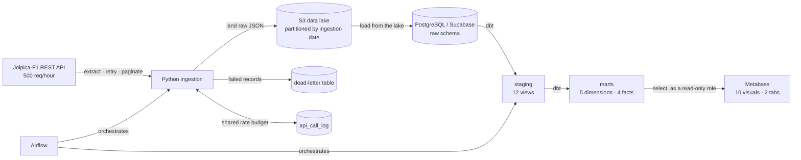
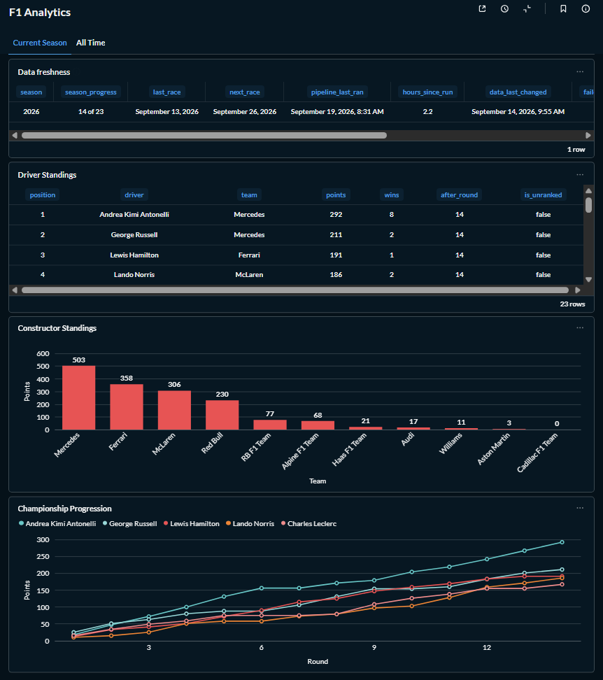
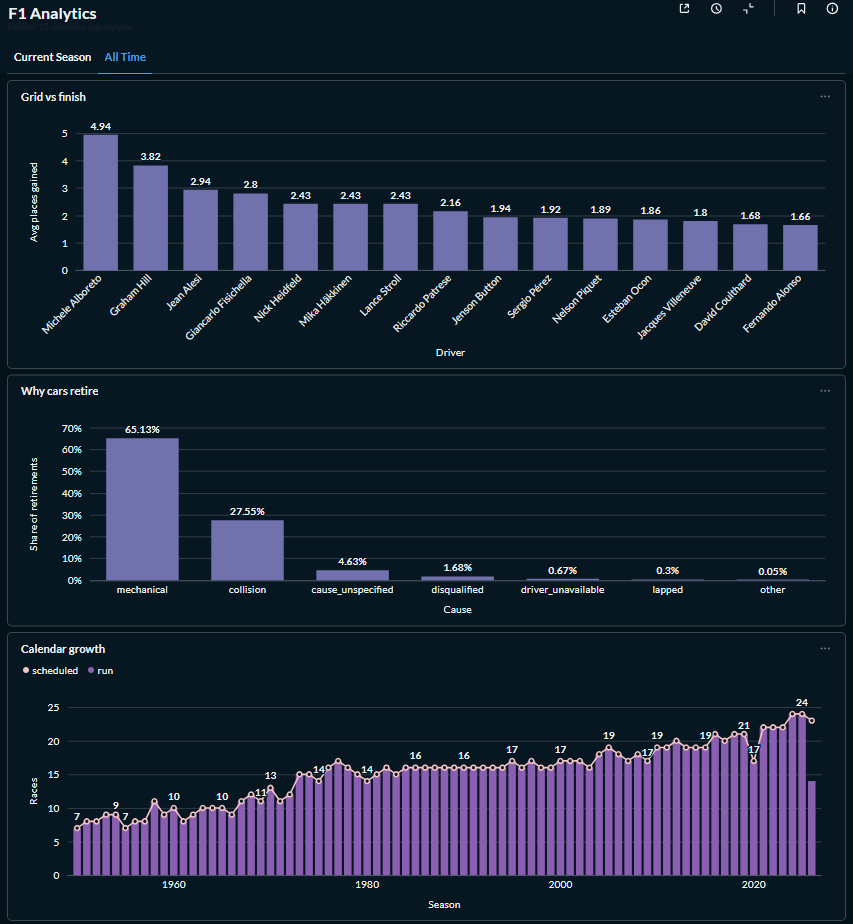
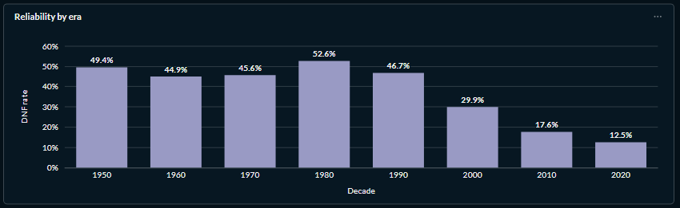
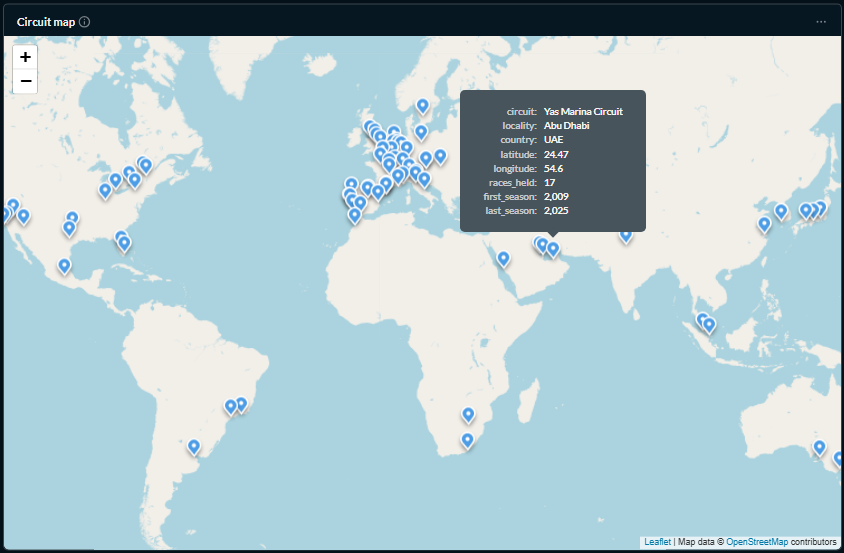
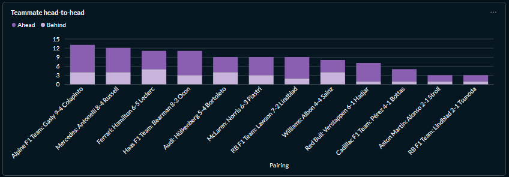
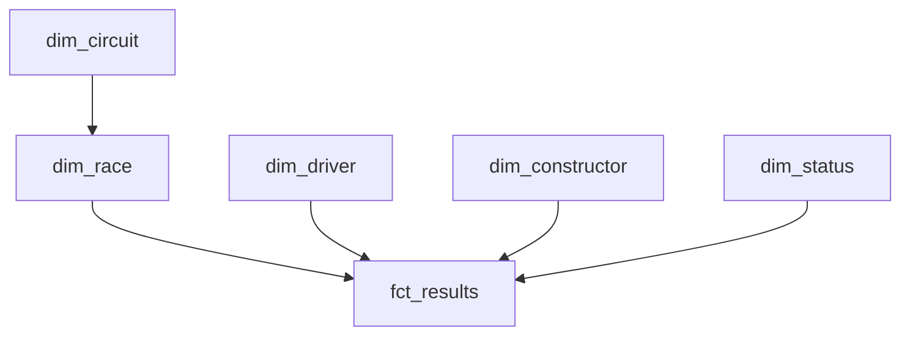

# F1 Analytics Pipeline

An end-to-end analytics engineering project: **77 seasons of Formula 1 results**
(1950–2026) pulled from a rate-limited public API, landed immutably in S3,
loaded into Postgres, and modelled into a tested Kimball star schema with dbt.



Every box is built, tested and running. The pipeline refreshes itself nightly
without intervention — see [Project status](#project-status).

| | |
|---|---|
| **Fact rows** | 26,092 race results · 34,931 driver standings · 13,635 constructor standings · 590 sprint results |
| **Coverage** | Every championship round from 1950 to 2026 |
| **dbt** | 247 nodes, 100% passing — every model declares and tests its grain |
| **Unit tests** | 58, no network |
| **Ingestion** | 12 endpoints, idempotent, checkpointed, resumable |
| **Orchestration** | Airflow, daily, with retries and failure reporting |
| **Serving** | Metabase, 10 visuals covering all six analytical themes |

_Row counts as of 2026-09-19. They move on their own — the scheduled run ingests
whatever has been raced since._

---

## What it answers

The star schema was designed **backwards from these questions**, not from the
shape of the source. Each one resolves against the model as built:

**Championship progress** — standings after any round; how the points gap
between title contenders evolved race by race.
→ `fct_driver_standings`, `fct_constructor_standings` (periodic snapshots).

**Race results and reliability** — finishing order, points, win and podium
rates, DNF rate by driver or constructor, and *why* cars retired.
→ `fct_results` joined to `dim_status`.

**Qualifying versus race day** — grid position against finishing position, and
which drivers most consistently gain places.
→ `grid_position`, `positions_gained` on `fct_results`.

**Head-to-head** — teammate against teammate within a season, driver against
driver across a shared one.
→ a self-join on `fct_results` at `(race_key, constructor_key)`; no bridge
table, because both keys sit on the fact.

**Circuit and season context** — where a driver has performed best historically,
how a constructor's form trended across seasons.
→ `dim_race` → `dim_circuit`.

A worked example — reliability across seventy-seven seasons, which is the kind
of answer only the full backfill makes possible:

| decade | starts | DNFs | DNF rate |
|---|---|---|---|
| 1950s | 1,847 | 913 | 49.4% |
| 1970s | 3,440 | 1,567 | 45.6% |
| 1980s | 3,938 | 2,070 | **52.6%** |
| 2000s | 3,624 | 1,083 | 29.9% |
| 2010s | 4,283 | 755 | 17.6% |
| 2020s | 2,906 | 362 | 12.5% |

Half the field failing to finish in the fifties, down to 13% today — with the
1980s bump where the turbo era belongs.

Rate is **per start, not per entry**: a car that never started did not fail to
finish, so non-starters leave both halves of the fraction. The two definitions
differ by up to 3.4 points — widest in the 1960s, 48.3% against 44.9% — which is
why the denominator is stated rather than assumed.

Every figure on this page comes from the committed models and can be reproduced
by running them.

### The dashboard

Ten visuals over two tabs, because one dashboard serving both purposes serves
neither — a reviewer wants the seventy-seven-season sweep, someone following the
championship wants last weekend.

**`Current Season`** — the championship as it stands, refreshed by the nightly
run:



The first card is the one worth a second look. **`pipeline_last_ran` and
`data_last_changed` are five days apart**, and that is correct rather than
broken: the warehouse upsert only writes when a payload actually differs, so a
run that succeeds and finds nothing new leaves the data untouched. A freshness
indicator built on "when did a row last change" would call a healthy pipeline
stale. `rpt_pipeline_freshness` exists to keep those two questions apart.

**`All Time`** — 1950 to 2026:



**Reliability by era** is the chart the seven-hour backfill bought. Three modern
seasons would have produced a single bar at 12.5% and no story at all:



**Every circuit Formula 1 has raced at** — 78 of them across 34 countries. The
one visual where the scale is felt rather than read:



**Teammate head-to-head** is the visual the schema was shaped for. `driver_key`
and `constructor_key` both sit on `fct_results` precisely so "same race, same
team, different driver" is a self-join on two keys rather than a bridge table:



The pair is ordered by who won, so the first name in each label always leads.
Ordering by `driver_key` would have been arbitrary — it is an MD5 hash — and the
first version of this chart did exactly that, leaving a reader unable to tell
which stacked segment belonged to whom.

The record counts **only races where both drivers were classified**: a teammate
who retires on lap 3 is not evidence the other was faster. Points are counted
across all races, because points are the outcome — so a pairing that leads the
head-to-head while losing on points is the interesting case, not an
inconsistency.

---

## Tech stack

| Layer | Choice | Why |
|---|---|---|
| Source | [Jolpica-F1](https://github.com/jolpica/jolpica-f1) | The maintained successor to Ergast, which shut down. Validated live before any table was designed |
| Ingestion | Python + `requests` | No framework needed for 12 endpoints; retry, backoff and pagination are explicit and testable |
| Lake | AWS S3 | Immutable landing zone, so the warehouse can be rebuilt without re-spending the API budget |
| Warehouse | PostgreSQL (Supabase) | Free tier, real Postgres, reachable from CI |
| Transformation | dbt Core | Tests, lineage and documentation live with the models rather than beside them |
| CI | GitHub Actions | `ruff` and `pytest` on every push |
| Orchestration | Airflow 3.0.2 (Docker) | Daily DAG, per-task retries, failure reporting. LocalExecutor — a queue buys nothing on one machine |
| Serving | Metabase (Docker, local) | Screenshots below rather than a hosted link: a link nobody maintains is worse than an image that stays true (PRD §8b) |

---

## Run it

Requires Python 3.13, a Postgres database, and an S3 bucket.

```bash
python tasks.py setup                        # venv, pinned deps, git hooks
cp .env.example .env                         # then fill in warehouse + S3 credentials
python tasks.py migrate                      # create the raw schema
python tasks.py ingest --season 2026 2025    # reference data + two seasons
python tasks.py transform                    # dbt build: models and their tests
```

`python tasks.py` on its own lists every task. A `Makefile` wraps the same
commands for anyone who prefers `make`.

To load the full history instead of two seasons:

```bash
python tasks.py backfill                     # 1950-2023, ~7.5 hours, resumable
```

That run is long because the source allows 500 requests an hour and the client
paces itself against a budget shared across processes. It checkpoints after
every page, so an interrupted run resumes rather than restarting — pass the
original `--partition` when resuming.

---

## Data model

Kimball star schema. Staging models are views that cast and rename; marts are
tables.

The core star, drawn around `fct_results`:



The other three facts hang off the same conformed dimensions —
`fct_sprint_results` off all four, the two standings facts off `dim_race` plus
their own entity. Conformed dimensions are the point: "Verstappen" means the
same row whether you reach it from a race result or a championship snapshot.

`dim_circuit` sits behind `dim_race` rather than on the facts, because a race
happens at exactly one circuit — the relationship belongs on the event
dimension, not repeated on every fact that references the event.

| Model | Grain | Rows |
|---|---|---|
| `dim_driver` | driver | 882 |
| `dim_constructor` | constructor | 215 |
| `dim_circuit` | circuit | 79 |
| `dim_race` | (season, round) | 1,173 |
| `dim_status` | finishing status | 137 |
| `fct_results` | (race, driver) | 26,092 |
| `fct_sprint_results` | (race, driver), sprint weekends | 590 |
| `fct_driver_standings` | (season, round, driver) | 34,931 |
| `fct_constructor_standings` | (season, round, constructor) | 13,635 |

Dimension row counts include one **Unknown member** each — a sentinel row facts
coalesce to when a key does not resolve, so an unmatched row is visible rather
than dropped by an inner join.

Two modelling choices worth calling out:

**Sprint results are a separate fact, not a `session_type` column.** Unioning
them into `fct_results` would make every existing query wrong by default:
finishing order, DNF rate and positions gained would silently include sprint
rows unless the author remembered the filter. A fact whose grain requires a
filter to be correct is a reliable source of wrong numbers.

**Standings are periodic snapshots, so `points` is a running total and not
additive across rounds.** Summing it over a season counts every point once per
subsequent round. `fct_results` and `fct_sprint_results` are the additive ones.

Column-level documentation and the full lineage graph are generated from the
models rather than hand-written:

```bash
python tasks.py docs                         # then: dbt docs serve --profiles-dir .
```

Design decisions, with the alternatives considered and why they lost, are logged
in [`context/ARCHITECTURE.md`](context/ARCHITECTURE.md) — 42 entries.

---

## Engineering notes

**Idempotency.** Every load is an upsert keyed on the natural grain, with
`where payload is distinct from excluded.payload` so an unchanged row is not
rewritten. Re-running any step inserts and updates nothing.

**Replayable by design.** The warehouse loads from lake objects, never from the
API response still in memory. `--load-only` rebuilds the warehouse from what has
already landed, at zero API cost.

**Retry, backoff and dead-letter** are in the first implementation, not a later
pass. Failed records land in `raw.failed_ingestions` with the payload fragment
and error, and the run continues.

**Rate limiting** is a sliding window backed by a table, so the budget is shared
across processes and survives a restart. A fixed hourly window would allow 1,000
requests in two minutes across a boundary.

**Testing.** Every dbt model declares and tests its
grain. Tests that could not meaningfully fail are treated as noise and left out
— legitimately nullable columns are documented rather than asserted.

The most valuable test is a business rule rather than a structural one:
`assert_standings_reconcile_with_results` derives a championship total from the
race and sprint facts and compares it against the official standings. It is
what revealed that sprint points were missing entirely — 2024 official 437 for
Verstappen against 399 derived — and it is scoped to 1991 onward, because before
that only a driver's best N results counted toward the title.

**CI.** GitHub Actions runs `ruff check .` and `pytest -q` on every push. A
committed `pre-push` hook runs the same checks locally.

---

## Project status

| Phase | State |
|---|---|
| 0 — Discovery | Complete. Every payload validated against the live API before any table was designed |
| 1 — Ingestion | Complete. 12 endpoints, full history loaded |
| 2 — Transformation | Complete. 12 staging views, 5 dimensions, 4 facts, 247 passing nodes |
| 3 — Orchestration | Complete. Airflow in Docker, daily, with retries and failure reporting. Runs unattended |
| 4 — Serving & polish | Complete. Metabase, 10 visuals over two tabs, all six analytical themes answered |

---

## Attribution and licensing

Data from **[Jolpica-F1](https://github.com/jolpica/jolpica-f1)**, licensed
under
**[CC BY-NC-SA 4.0](https://creativecommons.org/licenses/by-nc-sa/4.0/)**.

This project is non-commercial and will not be monetised.

Licensing here is deliberately split, because the two halves are not the same
kind of work:

- **Code** (`ingestion/`, `dbt/`, `discovery/`, `migrations/`, `tests/`,
  `airflow/`, `metabase/`) is the author's own and is not an adaptation of the
  data. Released under the **[MIT License](LICENSE)** — the `LICENSE` file
  covers the code only.

  The distinction matters: MIT permits commercial use, and the *data* does not.
  A reader who lifts a query and points it at their own warehouse is covered by
  MIT; one who republishes the F1 data it returns is bound by CC BY-NC-SA.
- **Data and data derivatives** — the star schema, any committed extract or
  sample payload, **dashboard screenshots**, and published figures — are
  adaptations and inherit **CC BY-NC-SA 4.0**, attributed to Jolpica-F1.

No bulk raw data is committed to this repository. Landing raw JSON in a private
object store is storage; redistributing it would not be.
