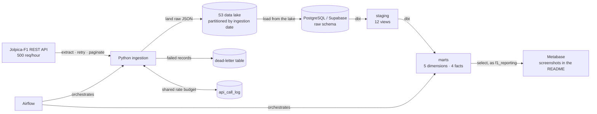

# Design & Architecture — F1 Analytics Pipeline

> Companion to [PRD.md](PRD.md). This document defines **how** the system is
> built and **why** each choice was made. Decisions are logged in §7.

---

## 1. Top-level system overview



**Three transformation layers, not four.** An earlier version of this diagram
showed an `aggregates / marts` layer between the star schema and the dashboard,
which SCHEMA §1 never specified and which does not exist — Metabase queries
`marts` directly. Corrected 2026-09-15 rather than left to mislead; the
implementation matching this diagram is a stated non-negotiable.

That is a deliberate omission, not an oversight. `fct_results` is 26k rows and
every dashboard query returns in milliseconds, so pre-aggregation would solve a
problem this project does not have, and each `rpt_` model would be another thing
to build, test and keep in sync. The project's own precedent is the SCD Type 2
reversal (decision 18): do not build structure the data does not call for.

**The cost accepted, stated plainly:** metric definitions now live in
`metabase/queries/*.sql`, which dbt neither tests nor enforces. The decision that
DNF rate is computed *per start* is documented there and nowhere a build could
check it, so a fifth chart could compute it *per entry* and nothing would catch
the contradiction.

**The trigger for building the layer** is therefore duplication, not volume: the
moment a metric is needed by a second chart, it becomes a dbt model with a tested
grain rather than a definition copied between two SQL files.

| Layer | Technology | Responsibility |
|---|---|---|
| Source | Jolpica-F1 REST API | System of record (external); 500 req/hour, no rate-limit headers |
| Ingestion | Python + requests | Extract, retry, paginate |
| Lake | AWS S3 | Immutable raw landing zone, replay source |
| Warehouse | PostgreSQL (Supabase) | Structured storage & compute |
| Transformation | dbt Core | Staging → dimensional model, tests, docs |
| Orchestration | Airflow 3.0.2 (Docker) | Scheduling, dependencies, retries, failure reporting |
| Serving | Metabase (Docker, local) | Dashboards; screenshots in the README — see PRD §8b |
| CI | GitHub Actions | Run tests on PR |

## 2. Design methodology

- **ELT, not ETL** — land raw first, transform in the warehouse. Raw data is
  never modified in place, so transformations are always replayable.
- **Layered (medallion-style) architecture** — `raw` → `staging` → `marts`.
  Each layer has exactly one job; no layer reaches past its neighbour.
- **Dimensional modelling (Kimball)** — conformed dimensions and fact tables at
  a declared grain, optimised for analytical queries and BI.
- **Declarative transformations** — dbt owns the DAG; dependencies are derived
  from `ref()`, never hand-ordered.

### Layer contract

| Layer | Materialisation | Allowed to do | Must NOT do |
|---|---|---|---|
| `raw` | tables | Store source payloads as-landed | Business logic, filtering |
| `staging` | views | Rename, cast, convert epochs, light cleaning | Joins, aggregation, business rules |
| `marts` | tables | Joins, business logic, surrogate keys, aggregation | Re-clean raw data |

## 3. Data flow

1. **Extract** — call the API with retry/backoff; paginate where the endpoint
   caps results.
2. **Land** — write raw JSON to `s3://<bucket>/raw/<entity>/<YYYY-MM-DD>/…`.
3. **Load** — read those objects back from S3 and upsert into the `raw` schema.
   The warehouse loads **from the lake**, never from the in-memory API response.
4. **Transform** — dbt builds `staging` views, then `marts` tables.
5. **Test** — dbt tests run as part of every build (`dbt build`).
6. **Serve** — BI reads only from `marts`.

> **Rule:** the implementation must match this diagram. If the architecture
> states the warehouse loads from the lake, the load step reads from lake
> objects — not from data still held in memory. Ambiguity here produces dead
> code and an architecture that cannot be explained honestly.

## 4. Design patterns

| Pattern | Where | Why |
|---|---|---|
| **Idempotent upsert** | All raw loads | Re-running a step never duplicates rows |
| ~~**Append-only snapshots**~~ | _not used_ | Phase 0 found no source that mutates an attribute in place; history is carried in natural keys instead. See SCHEMA §2 |
| **Immutable event append** | Match facts | Matches never change once played |
| **Retry with exponential backoff** | All API calls | Upstream 5xx/timeouts are routine, not exceptional |
| **Dead-letter log** | Record-level failures | Failures are recoverable, not silently lost |
| **Cursor pagination** | List endpoints | Work around per-call row caps |
| **Surrogate keys** | Dimensions | Decouple warehouse keys from source keys |
| **Unknown member** | Dimensions | Facts with unmatched FKs still join (no row loss) |
| **Incremental models** | Large facts | Process only new data per run |

### Classifying every source (do this in Phase 0)

The most important design question, asked **per source**, before any table is
created:

| Question | Load pattern |
|---|---|
| Immutable event? (a played match) | Insert, `ON CONFLICT DO NOTHING` |
| Mutable reference data, history not needed? | Upsert (`DO UPDATE`) |
| **Attributes change over time and history matters?** | **Append-only with `snapshot_date`** |

> **Rule:** an overwrite upsert discards the previous value. Any source whose
> history is needed for SCD Type 2 or trend analysis must be append-only from
> the start — this cannot be reconstructed later, because the overwritten
> values are gone.

## 5. Failure handling

| Failure | Response |
|---|---|
| Transient API error (429/5xx/timeout) | Retry with exponential backoff |
| Persistent failure on one record | Log to dead-letter table; continue the run |
| Non-transient error (404, bad request) | Fail fast — do not retry |
| Whole-run failure | Alert via orchestrator; run is re-runnable (idempotent) |

**Principle:** one bad record must never kill an entire run, and must never
vanish silently.

## 6. Conventions

> Agreed **before** coding. Conventions decided ad hoc during implementation
> produce inconsistency that has to be reworked across every model.

**Naming**
- Staging `stg_<source>` · Dimensions `dim_<entity>` · Facts `fct_<event>` ·
  Aggregates `mart_<subject>`
- Columns `snake_case`; booleans read as assertions (`is_`/`has_`); no reserved
  words
- Rename vague source columns at staging (`name` → `team_name`)

**Time**
- All timestamps **UTC**
- Source epochs converted to real timestamps at **staging**
- Keep the raw epoch alongside the derived timestamp for traceability

**Grain**
- Every model declares its grain in its description **and enforces it with a
  test**
- Composite grains use a multi-column uniqueness test

**Keys**
- Never include a nullable column in a primary key
- Prefer a guaranteed-present natural key over a sometimes-null identifier
- Confirm nullability from **observed data**, not documentation

**Testing**
- Test what downstream logic depends on; do not test descriptive fields
- Tiers: (1) grain/PK — always · (2) join keys, categoricals — usually ·
  (3) free text, metrics — rarely

## 7. Decision log (ADR-lite)

> Record the alternatives considered and the trade-off, not just the outcome.
> Add a row whenever a non-obvious choice is made.

| # | Decision | Alternatives considered | Rationale |
|---|---|---|---|
| 1 | ELT with a lake landing zone | Direct API → warehouse | Raw is replayable; transformations can be rebuilt without re-hitting the API |
| 2 | Warehouse loads **from the lake** | Parallel write to lake and warehouse | Single source of truth; the load step is independently replayable |
| 3 | Append-only snapshots for changing attributes | Overwrite upsert | Overwrite destroys the history SCD2 and trend models require. **Not triggered by any F1 source** (see 18, 19) — the rule stands, but no source meets it |
| 4 | Postgres (Supabase) as warehouse | BigQuery, Snowflake, Databricks, MotherDuck/DuckDB | Free and always-on; pipeline patterns are warehouse-agnostic. See §7.1 |
| 5 | dbt Core | Dataform, hand-written SQL | Industry standard for the target roles; tests, docs, and lineage built in |
| 6 | Retry + dead-letter from the first implementation | Add resilience later | Transient upstream failures are routine; retrofitting loses records |
| 7 | Airflow as orchestrator | Dagster, Prefect, cron/CI schedules | Heavier to run, but the most widely recognised orchestrator in the target job market |
| 8 | **Jolpica-F1 as the single source** (`api.jolpi.ca/ergast/f1`) | OpenF1, FastF1, Ergast | All 13 endpoints needed for PRD §6 returned 200 in Phase 0. Ergast is shut down; OpenF1 covers only telemetry (already parked); FastF1 is a library, so ingestion would be a cached wrapper call rather than an HTTP client with retry and dead-letter — the engineering this project exists to demonstrate |
| 9 | `discovery/` is separate from `ingestion/` | Put probes in `ingestion/`; delete after Phase 0 | Discovery code is evidence-gathering, not pipeline code, and must never be mistaken for it. Kept (not deleted) because the findings justify the schema; isolated one-way so neither side can import the other |
| 10 | Client-side pacing, not header-driven throttling | Read rate-limit headers at runtime | The API returns **no** rate-limit headers on any endpoint, so remaining allowance cannot be read. Budget comes from the published policy, enforced by deliberate pacing plus `Retry-After` on 429 |
| 11 | Page size fixed at the observed cap of 100 | Assume a larger page; read the cap from the response | `limit=2000` returns HTTP 200 with `"limit": "100"` — the server **silently clamps**. A backfill assuming a larger page would stop short and report success |
| 12 | Backfill at **season** scope, not race scope | One call per race | Season-scoped `results` returns 479 rows in 5 calls; race-scoped needs one call per race for the same data. Roughly a 5× reduction against a source with no published burst allowance. Does not apply to `pitstops`, `laps` or per-round standings, which reject or ignore season-scoped calls |
| 13 | **`laps` parked, not ingested** | Ingest capped (recent seasons only); ingest in full | Measured at ~14,000 backfill calls versus ~2,750 for everything else combined, and answers no question in PRD §6. A capped subset was rejected too: partial lap coverage invites analysis that silently excludes most of the sport's history |
| 14 | Strict `relationships` tests; Unknown member built but not load-bearing | Lenient FK tests; skip the Unknown member entirely | Join coverage measured at 100% over all 26,115 result rows (1950→2024), so strict tests will not produce false failures. The Unknown member is still built, because a source that later emits an unmatched key must route the row there rather than lose it to an inner join |
| 15 | `not_null` tests only on the six fields present in every era | Derive nullability from a recent-season sample | `FastestLap` is absent before 2000 and `Time` is present in 16–23% of rows pre-2000, but a 2024 sample reports them at 97% and 90%. Tests written off the modern sample would pass in development and fail once the backfill reached the 1990s |
| 16 | Backfill paced to the **hourly** budget (500/hr) and checkpointed as resumable | Pace to the 4/s burst limit; run the backfill in one pass | Documented limits are 4 req/s burst **and 500 req/hr sustained**. The hourly budget binds first: 4/s would exhaust it in ~2 minutes. At ~3,925 calls the backfill spans ~8 hours, so it must survive interruption and resume without re-fetching — which is idempotency (decision 6) being load-bearing rather than decorative |
| 17 | Repository licensing split: code separate from data | Single repository licence | Source data is CC BY-NC-SA 4.0, whose ShareAlike clause reaches adaptations of the *data* — the marts and any published extract — but not the code that produces them. One blanket licence would either over-claim the data or wrongly bind the code. See SECURITY §3 |
| 18 | **`dim_constructor` is Type 1 — reverses the earlier Type 2 decision** | Keep Type 2; Type 1 plus a hand-curated lineage seed | Walking every constructor list 1996–2024, no `constructorId` was ever observed carrying two names: rebrands are separate ids upstream. With no attribute changing in place, Type 2 would produce `valid_from`/`valid_to`/`is_current` columns over single-version rows. The lineage seed was rejected as scope; the cost is that cross-rebrand team continuity is not answerable, which is accepted |
| 19 | No SCD Type 2 anywhere in the project | Manufacture a Type 2 use case to demonstrate the technique | Decision 18 removed the only candidate. Every remaining source carries history in a natural key. Building the pattern where the data does not call for it is structure for its own sake, and is visible as such to anyone who queries the table |
| 20 | Warehouse reached via Supabase's **session pooler**, not the direct host | Direct connection; transaction pooler (port 6543) | The direct endpoint is IPv6-only on new projects and unreachable from most IPv4 networks — the risk §9 anticipated. The transaction pooler holds no session state, which breaks dbt. Session pooler verified working first attempt |
| 21 | Backfill runs **newest season first** | Oldest-first (chronological) | A working dashboard needs one complete recent season, not seventy partial ones, so newest-first produces something demonstrable within the first hour of an 8-hour job. Chronological order has no technical advantage here because loads are idempotent and order-independent. The cost is that the sparse early decades (see the era profile) arrive last, so their edge cases surface late — mitigated by already having measured them in Phase 0 |
| 22 | Prove **one endpoint end to end** before generalising | Build all extractors, then the lake loader, then the warehouse loader | The risky part is the *vertical* path — API → lake → warehouse — not the twelfth extractor. Proving it once surfaces path conventions, idempotency and checkpointing while there is one thing to debug. Building horizontally would multiply an unproven pattern twelve times before discovering it is wrong |
| 23 | Checkpoint state lives **in the warehouse** | A local file; an object in the lake | The backfill spans ~8 hours (decision 16) and must resume. A local file does not survive a machine change and is invisible to the orchestrator; a lake object needs a read-modify-write with no transactional guarantee. The warehouse gives transactional updates alongside the data the checkpoint describes, so state and data cannot disagree |
| 25 | **Historical backfill deferred until Phase 2 has models** | Backfill now, while ingestion is fresh; backfill incrementally as each endpoint lands | The machinery is ready — checkpointed per round, budget shared across restarts, loads idempotent — so this is about sequencing, not capability. ~3,900 calls at 500/hour is an ~8-hour unattended run, and today nothing downstream could tell whether the result was *correct*: 26,000 rows in `raw` with no staging models to test grain, coverage or era-dependent nullability against. Running it after the star schema exists means the tests that would catch a bad backfill already exist when it runs. The cost of waiting is nil — the data is 75 years old and re-fetchable; the cost of a silently wrong 8-hour load discovered in Phase 2 is doing it twice. Three current seasons (2024–2026) already exercise every code path |
| 24 | **Rate budget also lives in the warehouse** (`raw.api_call_log`), on its own connection | In-process counter; a local file; reading rate-limit headers | The API returns no rate-limit headers, so the budget must be counted client-side — and an in-process counter is blind across processes and resets on restart. Measured: a three-season ingest spent ~120 calls while no single process saw more than 72, and a resumed backfill would start counting from zero inside the same hour. A **separate connection** because recording a call must commit to be visible to other processes, and committing on the pipeline's connection would also commit whatever upsert was in flight. The burst limit stays in-process: a round-trip per request would cost more than it protects, and the hourly budget is the one that binds |
| 26 | **Facts coalesce unmatched keys to the Unknown member; a singular test detects drift** | Inner-join the dimensions; rely on `relationships` alone | SCHEMA §5 requires facts to map unmatched foreign keys to Unknown. An inner join would drop the row instead, and a dropped fact row is invisible — the total simply comes out lower and nothing errors. The consequence, named rather than discovered later: coalescing makes the `relationships` tests **vacuous**, since a coalesced key always resolves to a row that exists. `assert_no_facts_on_unknown_members` is what detects drift now. The pair is deliberate — `relationships` proves the key resolves, the singular test proves it resolved to something real |
| 27 | **`season` and `round` denormalised onto `fct_results`** | Keep the fact purely keyed and join `dim_race` for every slice | The line drawn is to denormalise what is *filtered on* constantly, not what is *joined for*. Almost every query slices by season, and forcing a dimension join for that is friction with no benefit. Driver, constructor and status names are deliberately **not** carried, because those are joined for, and duplicating a name invites two sources of truth for it |
| 28 | **Sprint results get their own fact, not a `session_type` column on `fct_results`** | Union sprint into `fct_results` with a session discriminator; leave sprint out of the marts entirely | Found while building the standings facts: the points reconciliation PRD §6 commits to does not work from `fct_results` alone — official 437 for Verstappen in 2024 against 399 derived. Race plus sprint reconciles exactly, 24 of 24 drivers, zero residual. A `session_type` column was tempting (`stg_sprint` was given identical column names so a union would be possible) but would make **every existing query wrong by default**: finishing order, DNF rate and positions gained would all include sprint rows unless the author remembered the filter. A fact whose grain requires a filter to be correct is a reliable source of wrong numbers. Separate facts are right by default, match the shape already used for `fct_qualifying`, and confine the cost to one explicit union where total points are needed |
| 29 | **The backfill is its own task, with `--resume` and a pinned lake partition** | A `--backfill` flag on `ingest`; a one-off script | The two have different failure models: `ingest` is a handful of calls for one season and can afford to die on the first error, while a backfill is ~3,800 calls over ~7.6 hours and must survive interruption, skip what it already did, and tolerate one awkward season (it stops at three consecutive failures — that is systemic, not data). The pinned partition is the non-obvious half. `--ingestion-date` defaults to *today, computed per process*, and the task spawns two processes per season, so a run crossing midnight UTC scatters seasons across two partitions. The sharper edge is on resume: `--resume` skips an extract whose checkpoint says complete, then the loader looks for objects under the *new* partition prefix, finds none, and loads nothing — a silent no-op that reads exactly like success. Resuming therefore means passing the original `--partition`, which is why the task echoes it at startup and names the log file after it |
| 30 | **The standings reconciliation test is scoped to 1991 onwards** | Delete the test; add a tolerance; reproduce the historical points rules | The historical backfill showed the test's premise — a championship total is the sum of the points scored — is a *modern* rule. 69 driver-seasons failed, none later than 1990, for two opposed reasons: **dropped scores** (until 1990 only a driver's best N results counted — in 1988 Prost scored 105 to Senna's 94 and lost the title 90-87), and **points the result rows do not carry** (shared drives splitting a car's points, and the fastest-lap point awarded 1950-1959). Neither is a modelling error and neither is fixable by summing differently — reproducing them means implementing sixty years of changing regulation, which serves no PRD §6 question. A tolerance would hide exactly the errors the test exists to find. Narrowing what it claims made it *stronger*, not weaker: it now compares 905 driver-seasons across 35 seasons against the 45 across 2 it had before, and still catches the missing-sprint-points bug (60 rows) |
| 31 | **`car_number` is `nullif`'d against the literal string `'None'`** | A general try-cast guard on every integer column; dropping the six rows | The source ships the string `'None'` as a car number on six withdrawn entries (1961 r4, 1962 r4, 1963 r10) — verified byte-for-byte in the landed lake object, so it is upstream: a stringified Python `None` that Ergast exported and Jolpica inherited. A sweep of every raw table found it nowhere else, so it is named where it occurs rather than guarded against everywhere — a blanket try-cast would silently swallow the *next* sentinel instead of failing loudly. Worth noting how it surfaced: staging models are views, so the cast was not evaluated until `fct_results` selected from it, and a descriptive column nothing joins on broke the build of the core fact |
| 32 | **The budget connection reconnects; the data connection does not** | Reconnect everywhere; reconnect nowhere; one shared connection | Decision 24 gave the rate budget its own connection so recording a call could commit without committing an in-flight upsert. The cost only showed at length: that connection is the longest-lived thing in the process — a backfill holds it for hours while it *sleeps out the rate limit* — which makes it precisely what a pooler reaps. Measured on the 2026-09-12 backfill: lost after 6.5 hours (`server closed the connection unexpectedly`), taking 1961's whole race-scoped phase down while the data connection beside it was healthy. Bounded retry with reconnect (3 attempts), not unbounded — a budget that cannot be recorded must fail loudly, or the process spends the allowance blind, which is what the terms let the source block us for. Retrying the insert can double-count a call whose commit landed as the link died; that is the safe direction, since the budget is a ceiling and over-counting spends an allowance we had while under-counting exceeds a limit. **Not** extended to the data connection: its statements sit inside transactions with real rollback semantics, and silently reconnecting mid-transaction would turn a loud failure into a partial load |
| 33 | **`dim_status` aliases era-renamed statuses before grouping, as an attribute rather than a key** | Group the raw text; collapse the aliases to one row; hash the canonical name | The full-history backfill showed the source renamed things: `+N Laps` became `Lapped` and `Withdrew` became `Did not start`, both in 2023, and there are within-era near-duplicates (`Puncture`/`Tyre puncture`, `Seat`/`Driver Seat`, `Injury`/`Injured`). Grouping raw text splits one concept at the rename, so a DNS-rate series shows a 2023 discontinuity that is vocabulary, not racing. **The aliasing had to be an attribute**: `status_key` hashes the raw `status` because that is what `fct_results` hashes, so hashing `status_canonical` instead would not error — the fact left-joins and coalesces, so 7,510 of 26,070 rows (28.8%) would land silently on the Unknown member, with `relationships`, `not_null` and the grain test all still green (decision 26). Only `assert_no_facts_on_unknown_members` would catch it. A surrogate key is a contract between the dimension and every fact joining to it; derived attributes are free to add, the hashed input is not. Renaming also destroys information, so `laps_down` preserves it where the source still carried it — 7,237 of 7,237 lapped rows through 2022, 0 of 388 after |
| 34 | **Alias only true synonyms; co-categorise everything else** | Alias any pair the source appears to have renamed; alias nothing and group raw text | Decision 33 established aliasing to close era renames. Applying it too eagerly was wrong, and running the DNF-rate check is what exposed it: `Withdrew` gives way to `Did not start` in 2023 and looks like another rename, but **23 of 245 `Withdrew` rows completed laps, one of them 74 (1996)** — the source used the word loosely for an entry pulled *after* running, so the alias made `status_canonical` assert "did not start" about a car that ran most of a race. `Eye injury` is the same shape: a subtype of injury, not another word for it, and folding it in discards the only detail the source gave. The distinction that settles it — **an alias rewrites what a row claims about itself; a shared category only claims the rows answer the same question.** Co-categorising still closes the discontinuity, because the break mattered at the category level, not the name level (`withdrawn_or_dns` runs 0, 1, 5, 3, 3 across 2021-2025). The category is named `withdrawn_or_dns` rather than `did_not_start` for the same reason: `dim_status` is per-status, not per-result, so it cannot verify a non-start it would be asserting |
| 35 | **The project runs in its own virtualenv inside the Airflow image** | Install `requirements.txt` into Airflow's environment; a separate container per task (`DockerOperator`) | The two dependency trees are incompatible, and measured rather than assumed: **protobuf 6.33.6 against Airflow's 4.25.8**, plus pydantic 2.13.4/2.11.5, click 8.4.2/8.2.1, typing_extensions and urllib3. Installing the project's pins into Airflow's environment would break Airflow itself — and only at runtime, after a build that looked successful. An isolated venv at `/home/airflow/project-venv` lets both sets of pins stay honest; the DAG calls that interpreter by full path. Verified in a throwaway container before building anything. `DockerOperator` is the better production answer and stays on the table, but it adds a Docker-socket mount and a second image to a phase where the DAG itself was already new |
| 36 | **LocalExecutor, and the Celery services removed** | Keep the official Compose file's CeleryExecutor stack | The official file ships CeleryExecutor: seven containers including redis, a Celery worker and a flower UI. This project runs a handful of tasks on one machine, so the queue buys nothing and costs comprehension — LocalExecutor runs tasks in the scheduler's own process, taking the stack from seven containers to four. **Switching the executor without removing the services is a trap**: the worker crash-looped 148 times while `docker compose ps` still reported it `Up`, because `airflow celery worker` is not a valid command when the executor is not Celery. The tell is uptime — a container far younger than its siblings has been restarting. Celery remains the right answer if work ever needs to spread across machines |
| 37 | **The DAG owns step ordering, not `tasks.py ingest`** | Have one Airflow task shell out to `tasks.py ingest`, which already runs the steps in order | `task_ingest` runs reference data, then season entities, then race entities in a Python loop — that ordering is real (race-scoped entities read their rounds from `raw.races`, so running them first silently does nothing) but it is *orchestration*, which is now Airflow's job. As separate tasks each step gets its own retries, its own log and a visible place in the graph; one opaque call would waste most of what the orchestrator is for. Forced by a practical constraint too: `tasks.py` hardcodes `VENV = REPO_ROOT / ".venv"` and exits if it is missing, and in the container that path is the host's **Windows** venv. The DAG calls `python -m ingestion.pipeline` directly instead. **`--resume` is deliberately absent** — right for the backfill, wrong for a scheduled refresh, which exists precisely to re-fetch results amended after stewards' decisions |
| 38 | **The DAG is scheduled daily, and the season comes from the clock rather than from `logical_date`** | Derive the season from `{{ logical_date.year }}`; keep it a hardcoded constant; schedule weekly | This job refreshes *current state* — the source has no time-window query, so asking for 2026 returns every 2026 result, always. There is no daily slice to fetch, so a run does not represent a period, and keying the season off the run's date would borrow a semantic the job does not have. `$(date -u +%Y)` in the shell says exactly what is meant. **Airflow 3 independently agrees**: verified in the running container that `schedule="@daily"` resolves to `CronTriggerTimetable` — *fire at 00:00* — with a **zero-width data interval**, not Airflow 2's `CronDataIntervalTimetable` where a run represented the window before it. `logical_date`, `data_interval_start` and `data_interval_end` are also all **nullable** in Airflow 3, so templating on them would break on an asset-triggered or manual run. Daily rather than weekly because results are adjudicated — stewards can change a classification days later and a weekly run would miss amendments, at ~80 calls a day against a 500/hour budget. `catchup=False` because fourteen missed triggers would fetch the identical thing fourteen times; `max_active_runs=1` because two concurrent runs would compete for the same budget and interleave writes to one lake partition |
| 39 | **Failure alerting is an `on_failure_callback` emitting a structured log record, built from the task instance rather than the context** | Read `exception`/`reason`/`try_number` from the callback context, as the type hints suggest; wire SMTP email or a Slack webhook now | The callback fires **once, after the final attempt** — not per retry, since a task in `up_for_retry` has not failed yet and alerting on every attempt is how a channel becomes noise people ignore. Verified: a `retries=2` task writes the record in attempt 3's log and in neither of the first two. **The callback context is not the template context.** Airflow's `Context` type lists `exception`, `reason`, `try_number`, `logical_date` and the `ds`/`ts` macros; **none are populated for a task callback in 3.0.2**, so the first version printed `None` for all three — an alert saying a failure happened without saying anything about it, which reads as working. Measured by dumping the live context from inside a failing task. Everything now comes off the task instance, and the exception is deliberately absent because Airflow logs the traceback to the same file immediately above, which is why the alert carries the **log path**. Same trap in the enum: `ti.state` is the SDK's `TaskInstanceState`, a plain Enum, while the same-named enum in `airflow.utils.state` overrides `__str__` — testing the wrong one reports the code is fine when it is not, so `.value` is taken explicitly. Transport is a log record because this Airflow runs on one machine and the UI is the alert channel; email or Slack replaces the function body and nothing else |
| 40 | **The dashboard connects as a separate read-only role, and the grant is made durable with default privileges** | Reuse `f1_pipeline`; grant `select` on today's tables and stop there | `f1_pipeline` **owns** raw, staging and marts, so a BI tool holding that credential could drop the tables it draws from — a large blast radius for something whose only verb is `select`. `f1_reporting` gets `select` on `marts` and nothing else; reporting reads the modelled layer, and a question `marts` cannot answer is a new model rather than a wider grant. **The non-obvious half is section 4 of the migration.** `grant select on all tables` covers the tables that exist at that moment, and every `dbt build` drops and recreates each mart — a recreated table is a new object inheriting none of yesterday's grants. Without `alter default privileges for role f1_pipeline`, the dashboard would work on the day it was set up and lose access on the next scheduled DAG run, with nothing to point at. Verified by connecting as the role: 11/11 — reads `marts`, refused on `raw`, `staging`, insert, update, delete, create and drop. Testing only what a least-privilege role *can* do is not testing it |
| 41 | **Metabase self-hosted locally, with screenshots in the README rather than a hosted dashboard link** | Evidence.dev built to a free static host; Streamlit Community Cloud; Looker Studio; Metabase Cloud | Full reasoning in PRD §8b; recorded here so the decision log is complete. The short version: a link nobody maintains is worse than a screenshot, and the author's own assessment was that it would not be maintained past six months. Free hosting for Metabase does not really exist either — it is a stateful JVM application needing ~2 GB and an always-on process, so Vercel and Netlify cannot run it at all and Metabase Cloud is ~$85/month. Evidence.dev was the real contender, since a static build cannot rot and exposes no database, but it adds a Node toolchain to a Python repository that CI cannot lint or test — and CI cannot build it either, because building queries the warehouse and CI holds no credentials by design. Screenshots reach every README reader; a link reaches the minority who click. Cost accepted: no interactive exploration for reviewers, demonstrated live in interviews instead |
| 42 | **A historical mention of the S3 bucket name is accepted rather than purged from git history** | Rewrite all 82 commits with `git filter-repo`; delete and recreate the repository; rename the bucket now | A pre-publish sweep of all 82 commits found **no credential has ever been committed** — no passwords, no AWS keys, no `PROFILE.md`/`CLAUDE.md`/`.env`, and `dbt/profiles.yml` has only ever used `env_var()`. The single exception is the **bucket name** in 8 historical blobs of SECURITY_AND_GOVERNANCE.md, removed from the working tree by `e219fea` when the no-identifiers rule was introduced. It is an identifier, not a credential: the bucket blocks public access and is reached only by a scoped IAM user with no `DeleteObject`, so nothing in history grants access to anything. Purging it means changing every SHA, or destroying **25 pull requests** whose descriptions record the reasoning behind most decisions in this project — a more valuable asset than a private bucket's name is a liability. **The one thing this constrains:** SECURITY §3 notes that a deleted bucket name can be claimed by someone else, so this bucket must be renamed or replaced rather than simply deleted. Renaming it whenever convenient makes the historical mention inert |

> Rows 1–7 are stack/pattern choices that carry over from the previous project
> and are independent of the data source. **F1-specific decisions — source
> selection, volume caps, load-pattern classification, connection endpoints,
> type/nullability calls — get logged here as they are made during F1 Phase 0
> and beyond.** Do not carry any source-specific finding over without
> re-validating it against the F1 API.

### 7.1 Warehouse choice — trade-offs

The most consequential trade-off in the stack, and the one most likely to be
questioned. Recorded here in full.

**The trade-off:** PostgreSQL is a row-store OLTP database, not a columnar MPP
analytical warehouse. The warehouses named in most job specifications
(Snowflake, BigQuery, Databricks, Redshift) are columnar systems built for
analytical scan performance.

**Why Postgres is chosen anyway:**

| Factor | Reasoning |
|---|---|
| **Scale** | At this project's data volume (tens of thousands of rows), columnar storage and MPP provide no measurable benefit. The engine is not the bottleneck. |
| **Cost & availability** | Must be free *and* always-on. Most managed analytical warehouses offer only time-limited trials, which expire and leave the project broken. |
| **Portability of the patterns** | The techniques demonstrated — idempotent loads, layered modelling, dimensional design, incremental processing, testing — are warehouse-agnostic. They transfer to any engine. |
| **Focus** | Re-platforming costs days of migration and retesting for no functional gain. That effort is better spent on the dimensional model, tests, and documentation, which are what actually differentiate the work. |

**What is given up:**
- Columnar scan performance and MPP scale-out (irrelevant at this volume).
- The keyword recognition of a warehouse name that appears on job specifications.
- Warehouse-specific features (clustering, partition pruning, time travel).

**Alternatives assessed:**

| Option | Verdict |
|---|---|
| **BigQuery free tier** | Strongest free analytical warehouse (permanent free allowance, genuinely columnar). Rejected here only because the goal is to demonstrate an open-source stack distinct from existing cloud-warehouse experience. |
| **MotherDuck / DuckDB** | Genuinely columnar with a mature dbt adapter and minimal infrastructure. The most likely future swap if a columnar engine becomes desirable. |
| **Databricks Free Edition** | Viable; heavier setup than the project needs. |
| **Snowflake, Redshift, ClickHouse Cloud** | Rejected — trial-limited, so the project would stop working once credits expire. |
| **Neon, Aiven, Render Postgres** | Equivalent to the current choice; row-store, no analytical advantage. |

**Revisit if:** data volume grows beyond a few million rows, query latency
becomes a real constraint, or a columnar engine is needed to demonstrate a
specific capability. Any migration happens **after** the MVP is complete, never
in place of it.

**Operational notes for this choice:**
- Free-tier managed Postgres may **pause after a period of inactivity**. A daily
  scheduled run keeps the project active — an intentional benefit of the
  orchestration layer, not a coincidence.
- Free-tier storage is capped; monitor size and keep high-volume tables bounded
  (set the concrete caps during F1 Phase 0).
- Object storage free tiers may be time-limited on new accounts; data volume here
  is small enough that post-expiry cost is negligible, but it is not free forever.

## 8. Environments

| Environment | Purpose |
|---|---|
| `dev` | Local development; personal schema; small data volumes |
| `prod` | Scheduled runs; full volumes |

Configuration is environment-variable driven; **no credentials in code or
committed config**. See [SECURITY_AND_GOVERNANCE.md](SECURITY_AND_GOVERNANCE.md).

## 9. Key implementation notes

- **Rate limiting** — respect documented quotas; pace requests deliberately.
- **Pagination** — list endpoints cap rows per call; page with a cursor until
  the target count is reached.
- **Partitioning** — lake objects partitioned by ingestion date for replay and
  traceability.
- **Idempotency proof** — running the pipeline twice must leave row counts
  unchanged. Treat this as an acceptance test, not an assumption.
- **Connection endpoints** — managed databases may require a pooler endpoint
  rather than the direct host, and the direct host may not be reachable on all
  networks. Confirm the working connection string in Phase 0.

## 10. Repository structure

```
.
├── CLAUDE.md                  # entry point: points at context/ before any work
├── README.md                  # the artifact reviewers actually read
├── context/                   # planning docs (this folder)
├── discovery/                 # Phase 0 probes + findings; throwaway, never imported
│   ├── probe_source.py
│   └── findings/              # committed evidence behind the schema decisions
├── ingestion/                 # extraction + load to lake + load to warehouse
│   ├── config.py             # single source of env-var config (§6)
│   ├── extract.py
│   ├── load_lake.py
│   ├── load_warehouse.py
│   └── pipeline.py            # CLI entry point
├── migrations/                # ordered, committed schema changes
├── dbt/
│   ├── models/
│   │   ├── staging/
│   │   └── marts/{dimensions,facts,aggregates}/
│   ├── macros/
│   ├── tests/                 # singular (custom) data tests
│   ├── dbt_project.yml
│   └── profiles.yml           # env_var references only
├── airflow/
│   ├── dags/
│   └── docker-compose.yml
├── tests/                     # Python unit tests (pytest)
├── .github/workflows/         # CI
├── .env.example
├── .gitignore
└── requirements.txt           # or pyproject.toml
```

**Rules**
- One responsibility per module; `pipeline.py` orchestrates, it does not
  implement extraction or loading.
- Nothing outside `ingestion/` talks to the source API **in the pipeline**.
  `discovery/` is the one exception: it exists to call the API before the
  pipeline exists. It is one-way isolated — `discovery/` never imports from
  `ingestion/`, and `ingestion/` never imports from `discovery/`. Findings
  move between them as documented facts, not as shared code.
- Nothing outside `dbt/` writes to the `staging` or `marts` schemas.

## 11. Development environment

| Item | Decision |
|---|---|
| Python version | Pin one version; record it in the README and CI |
| Environment | Virtual environment, created from a committed dependency file |
| Dependencies | **Pinned versions** — reproducibility is a stated requirement |
| Task runner | A `Makefile` (or equivalent) wrapping the common commands |

**Target: a fresh clone is running in under 15 minutes**, following the README
only. The command surface should be small enough to fit in three lines:

```
make setup      # create venv, install pinned dependencies
make ingest     # run the pipeline end to end
make transform  # dbt deps + dbt build (models + tests)
```

Wrapping commands in a task runner also removes the need to remember long
invocations, and gives CI and the README a single source of truth.

## 12. Testing strategy (application code)

Data quality tests are covered in
[SECURITY_AND_GOVERNANCE §4](SECURITY_AND_GOVERNANCE.md#4-data-quality-framework).
This section covers the **Python code**, which data tests do not reach.

| Test type | Scope | Runs |
|---|---|---|
| **Unit** | Pure logic, external calls mocked | Every commit / CI |
| **Integration (smoke)** | Real connectivity to storage and warehouse | Manually / scheduled, not in PR CI |
| **Acceptance** | Idempotency: run twice, row counts unchanged | Before merging pipeline changes |

**What is worth unit testing:**
- **Pagination loop** — terminates correctly, requests the right cursor, returns
  the requested number of records without duplicates.
- **Retry logic** — retries on transient failures, does **not** retry
  non-transient ones, gives up after the configured attempts. Branching logic
  like this is where silent bugs hide.
- **Parsing and type conversion** — timestamp/epoch handling, field extraction,
  handling of missing or null fields.
- **Configuration loading** — required settings are present and validated.

**What is not worth unit testing:** thin wrappers around library calls, and
anything whose only behaviour is delegation.

**Rules**
- Unit tests **never** call the real API or a real database — mock the boundary.
  Tests that depend on the network are flaky and will be ignored.
- Every bug fixed gets a test that reproduces it first.
- Coverage is a diagnostic, not a target; chasing a percentage produces tests
  that assert nothing.

## 13. CI/CD pipeline

Runs on every pull request; **must be green to merge**.

| Stage | Checks |
|---|---|
| **Lint** | Python linter/formatter check (e.g. ruff); SQL linter (e.g. sqlfluff) |
| **Unit tests** | `pytest` — no network access required |
| **dbt validation** | `dbt deps`, then `dbt build` against an isolated CI schema |
| **Docs** | `dbt docs generate` succeeds (catches broken refs and descriptions) |

**Notes**
- `dbt build` needs a database. Either point CI at a dedicated CI schema in the
  warehouse, or spin up a throwaway Postgres service container in the workflow.
  If neither is available, fall back to `dbt parse` / `dbt compile` so at least
  references and syntax are validated.

**As implemented, 2026-09-15** — the table above is the target; this is what
`.github/workflows/ci.yml` actually runs, and the gap is stated rather than left
for a reader to discover:

| Stage | Status |
|---|---|
| `ruff check .` | ✅ |
| `pytest -q` | ✅ |
| `dbt deps` + `dbt parse` | ✅ the documented fallback — CI holds no warehouse credentials, so `build` is not available |
| `dbt build` | ❌ needs a database; deliberately out |
| sqlfluff | ❌ promised for Phase 2, never adopted |
| `dbt docs generate` | ❌ not wired up |

**"Must be green to merge" is also aspirational.** Branch protection requires a
paid plan for private repositories, so CI here is *advisory* — two pull requests
merged red before that was noticed. The committed `hooks/pre-push` runs the same
checks earlier as partial compensation; it is not equivalent, since `--no-verify`
bypasses it. This becomes a real gate when the repository goes public.

The dbt step arrived on 2026-09-15, three days after Phase 2 finished. In the
interim a broken `ref()` would have passed CI — and `tasks.py` carried a comment
claiming CI already ran it.
- CI must read credentials from repository secrets — never from committed files.
- Keep CI fast enough that it is not routinely bypassed; a slow pipeline is a
  disabled pipeline.
