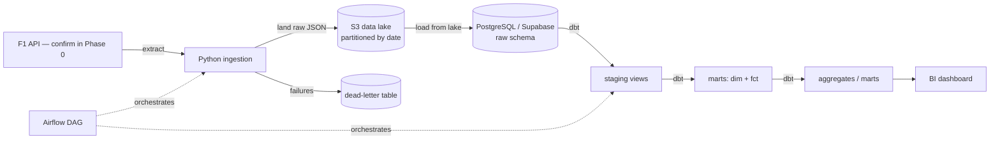

# Design & Architecture — F1 Analytics Pipeline

> Companion to [PRD.md](PRD.md). This document defines **how** the system is
> built and **why** each choice was made. Decisions are logged in §7.

---

## 1. Top-level system overview



| Layer | Technology | Responsibility |
|---|---|---|
| Source | F1 REST API _(confirm in Phase 0)_ | System of record (external) |
| Ingestion | Python + requests | Extract, retry, paginate |
| Lake | AWS S3 | Immutable raw landing zone, replay source |
| Warehouse | PostgreSQL (Supabase) | Structured storage & compute |
| Transformation | dbt Core | Staging → dimensional model, tests, docs |
| Orchestration | Airflow (Docker) | Scheduling, dependencies, alerting |
| Serving | Metabase / BI | Dashboards |
| CI | GitHub Actions | Run tests on PR |

## 2. Design methodology

- **ELT, not ETL** — land raw first, transform in the warehouse. Raw data is
  never modified in place, so transformations are always replayable.
- **Layered (medallion-style) architecture** — `raw` → `staging` → `marts`.
  Each layer has exactly one job; no layer reaches past its neighbour.
- **Dimensional modelling (Kimball)** — conformed dimensions and fact tables at
  a declared grain, optimised for analytical queries and BI.
- **Declarative transformations** — dbt owns the DAG; dependencies are derived
  from `ref()`, never hand-ordered.

### Layer contract

| Layer | Materialisation | Allowed to do | Must NOT do |
|---|---|---|---|
| `raw` | tables | Store source payloads as-landed | Business logic, filtering |
| `staging` | views | Rename, cast, convert epochs, light cleaning | Joins, aggregation, business rules |
| `marts` | tables | Joins, business logic, surrogate keys, aggregation | Re-clean raw data |

## 3. Data flow

1. **Extract** — call the API with retry/backoff; paginate where the endpoint
   caps results.
2. **Land** — write raw JSON to `s3://<bucket>/raw/<entity>/<YYYY-MM-DD>/…`.
3. **Load** — read those objects back from S3 and upsert into the `raw` schema.
   The warehouse loads **from the lake**, never from the in-memory API response.
4. **Transform** — dbt builds `staging` views, then `marts` tables.
5. **Test** — dbt tests run as part of every build (`dbt build`).
6. **Serve** — BI reads only from `marts`.

> **Rule:** the implementation must match this diagram. If the architecture
> states the warehouse loads from the lake, the load step reads from lake
> objects — not from data still held in memory. Ambiguity here produces dead
> code and an architecture that cannot be explained honestly.

## 4. Design patterns

| Pattern | Where | Why |
|---|---|---|
| **Idempotent upsert** | All raw loads | Re-running a step never duplicates rows |
| **Append-only snapshots** | Slowly-changing sources | Preserves history needed for SCD2 & trends |
| **Immutable event append** | Match facts | Matches never change once played |
| **Retry with exponential backoff** | All API calls | Upstream 5xx/timeouts are routine, not exceptional |
| **Dead-letter log** | Record-level failures | Failures are recoverable, not silently lost |
| **Cursor pagination** | List endpoints | Work around per-call row caps |
| **Surrogate keys** | Dimensions | Decouple warehouse keys from source keys |
| **Unknown member** | Dimensions | Facts with unmatched FKs still join (no row loss) |
| **Incremental models** | Large facts | Process only new data per run |

### Classifying every source (do this in Phase 0)

The most important design question, asked **per source**, before any table is
created:

| Question | Load pattern |
|---|---|
| Immutable event? (a played match) | Insert, `ON CONFLICT DO NOTHING` |
| Mutable reference data, history not needed? | Upsert (`DO UPDATE`) |
| **Attributes change over time and history matters?** | **Append-only with `snapshot_date`** |

> **Rule:** an overwrite upsert discards the previous value. Any source whose
> history is needed for SCD Type 2 or trend analysis must be append-only from
> the start — this cannot be reconstructed later, because the overwritten
> values are gone.

## 5. Failure handling

| Failure | Response |
|---|---|
| Transient API error (429/5xx/timeout) | Retry with exponential backoff |
| Persistent failure on one record | Log to dead-letter table; continue the run |
| Non-transient error (404, bad request) | Fail fast — do not retry |
| Whole-run failure | Alert via orchestrator; run is re-runnable (idempotent) |

**Principle:** one bad record must never kill an entire run, and must never
vanish silently.

## 6. Conventions

> Agreed **before** coding. Conventions decided ad hoc during implementation
> produce inconsistency that has to be reworked across every model.

**Naming**
- Staging `stg_<source>` · Dimensions `dim_<entity>` · Facts `fct_<event>` ·
  Aggregates `mart_<subject>`
- Columns `snake_case`; booleans read as assertions (`is_`/`has_`); no reserved
  words
- Rename vague source columns at staging (`name` → `team_name`)

**Time**
- All timestamps **UTC**
- Source epochs converted to real timestamps at **staging**
- Keep the raw epoch alongside the derived timestamp for traceability

**Grain**
- Every model declares its grain in its description **and enforces it with a
  test**
- Composite grains use a multi-column uniqueness test

**Keys**
- Never include a nullable column in a primary key
- Prefer a guaranteed-present natural key over a sometimes-null identifier
- Confirm nullability from **observed data**, not documentation

**Testing**
- Test what downstream logic depends on; do not test descriptive fields
- Tiers: (1) grain/PK — always · (2) join keys, categoricals — usually ·
  (3) free text, metrics — rarely

## 7. Decision log (ADR-lite)

> Record the alternatives considered and the trade-off, not just the outcome.
> Add a row whenever a non-obvious choice is made.

| # | Decision | Alternatives considered | Rationale |
|---|---|---|---|
| 1 | ELT with a lake landing zone | Direct API → warehouse | Raw is replayable; transformations can be rebuilt without re-hitting the API |
| 2 | Warehouse loads **from the lake** | Parallel write to lake and warehouse | Single source of truth; the load step is independently replayable |
| 3 | Append-only snapshots for changing attributes | Overwrite upsert | Overwrite destroys the history SCD2 and trend models require |
| 4 | Postgres (Supabase) as warehouse | BigQuery, Snowflake, Databricks, MotherDuck/DuckDB | Free and always-on; pipeline patterns are warehouse-agnostic. See §7.1 |
| 5 | dbt Core | Dataform, hand-written SQL | Industry standard for the target roles; tests, docs, and lineage built in |
| 6 | Retry + dead-letter from the first implementation | Add resilience later | Transient upstream failures are routine; retrofitting loses records |
| 7 | Airflow as orchestrator | Dagster, Prefect, cron/CI schedules | Heavier to run, but the most widely recognised orchestrator in the target job market |

> Rows 1–7 are stack/pattern choices that carry over from the previous project
> and are independent of the data source. **F1-specific decisions — source
> selection, volume caps, load-pattern classification, connection endpoints,
> type/nullability calls — get logged here as they are made during F1 Phase 0
> and beyond.** Do not carry any source-specific finding over without
> re-validating it against the F1 API.

### 7.1 Warehouse choice — trade-offs

The most consequential trade-off in the stack, and the one most likely to be
questioned. Recorded here in full.

**The trade-off:** PostgreSQL is a row-store OLTP database, not a columnar MPP
analytical warehouse. The warehouses named in most job specifications
(Snowflake, BigQuery, Databricks, Redshift) are columnar systems built for
analytical scan performance.

**Why Postgres is chosen anyway:**

| Factor | Reasoning |
|---|---|
| **Scale** | At this project's data volume (tens of thousands of rows), columnar storage and MPP provide no measurable benefit. The engine is not the bottleneck. |
| **Cost & availability** | Must be free *and* always-on. Most managed analytical warehouses offer only time-limited trials, which expire and leave the project broken. |
| **Portability of the patterns** | The techniques demonstrated — idempotent loads, layered modelling, dimensional design, SCD Type 2, incremental processing, testing — are warehouse-agnostic. They transfer to any engine. |
| **Focus** | Re-platforming costs days of migration and retesting for no functional gain. That effort is better spent on the dimensional model, tests, and documentation, which are what actually differentiate the work. |

**What is given up:**
- Columnar scan performance and MPP scale-out (irrelevant at this volume).
- The keyword recognition of a warehouse name that appears on job specifications.
- Warehouse-specific features (clustering, partition pruning, time travel).

**Alternatives assessed:**

| Option | Verdict |
|---|---|
| **BigQuery free tier** | Strongest free analytical warehouse (permanent free allowance, genuinely columnar). Rejected here only because the goal is to demonstrate an open-source stack distinct from existing cloud-warehouse experience. |
| **MotherDuck / DuckDB** | Genuinely columnar with a mature dbt adapter and minimal infrastructure. The most likely future swap if a columnar engine becomes desirable. |
| **Databricks Free Edition** | Viable; heavier setup than the project needs. |
| **Snowflake, Redshift, ClickHouse Cloud** | Rejected — trial-limited, so the project would stop working once credits expire. |
| **Neon, Aiven, Render Postgres** | Equivalent to the current choice; row-store, no analytical advantage. |

**Revisit if:** data volume grows beyond a few million rows, query latency
becomes a real constraint, or a columnar engine is needed to demonstrate a
specific capability. Any migration happens **after** the MVP is complete, never
in place of it.

**Operational notes for this choice:**
- Free-tier managed Postgres may **pause after a period of inactivity**. A daily
  scheduled run keeps the project active — an intentional benefit of the
  orchestration layer, not a coincidence.
- Free-tier storage is capped; monitor size and keep high-volume tables bounded
  (set the concrete caps during F1 Phase 0).
- Object storage free tiers may be time-limited on new accounts; data volume here
  is small enough that post-expiry cost is negligible, but it is not free forever.

## 8. Environments

| Environment | Purpose |
|---|---|
| `dev` | Local development; personal schema; small data volumes |
| `prod` | Scheduled runs; full volumes |

Configuration is environment-variable driven; **no credentials in code or
committed config**. See [SECURITY_AND_GOVERNANCE.md](SECURITY_AND_GOVERNANCE.md).

## 9. Key implementation notes

- **Rate limiting** — respect documented quotas; pace requests deliberately.
- **Pagination** — list endpoints cap rows per call; page with a cursor until
  the target count is reached.
- **Partitioning** — lake objects partitioned by ingestion date for replay and
  traceability.
- **Idempotency proof** — running the pipeline twice must leave row counts
  unchanged. Treat this as an acceptance test, not an assumption.
- **Connection endpoints** — managed databases may require a pooler endpoint
  rather than the direct host, and the direct host may not be reachable on all
  networks. Confirm the working connection string in Phase 0.

## 10. Repository structure

```
.
├── CLAUDE.md                  # entry point: points at context/ before any work
├── README.md                  # the artifact reviewers actually read
├── context/                   # planning docs (this folder)
├── ingestion/                 # extraction + load to lake + load to warehouse
│   ├── config.py             # single source of env-var config (§6)
│   ├── extract.py
│   ├── load_lake.py
│   ├── load_warehouse.py
│   └── pipeline.py            # CLI entry point
├── migrations/                # ordered, committed schema changes
├── dbt/
│   ├── models/
│   │   ├── staging/
│   │   └── marts/{dimensions,facts,aggregates}/
│   ├── macros/
│   ├── tests/                 # singular (custom) data tests
│   ├── dbt_project.yml
│   └── profiles.yml           # env_var references only
├── airflow/
│   ├── dags/
│   └── docker-compose.yml
├── tests/                     # Python unit tests (pytest)
├── .github/workflows/         # CI
├── .env.example
├── .gitignore
└── requirements.txt           # or pyproject.toml
```

**Rules**
- One responsibility per module; `pipeline.py` orchestrates, it does not
  implement extraction or loading.
- Nothing outside `ingestion/` talks to the source API.
- Nothing outside `dbt/` writes to the `staging` or `marts` schemas.

## 11. Development environment

| Item | Decision |
|---|---|
| Python version | Pin one version; record it in the README and CI |
| Environment | Virtual environment, created from a committed dependency file |
| Dependencies | **Pinned versions** — reproducibility is a stated requirement |
| Task runner | A `Makefile` (or equivalent) wrapping the common commands |

**Target: a fresh clone is running in under 15 minutes**, following the README
only. The command surface should be small enough to fit in three lines:

```
make setup      # create venv, install pinned dependencies
make ingest     # run the pipeline end to end
make transform  # dbt deps + dbt build (models + tests)
```

Wrapping commands in a task runner also removes the need to remember long
invocations, and gives CI and the README a single source of truth.

## 12. Testing strategy (application code)

Data quality tests are covered in
[SECURITY_AND_GOVERNANCE §4](SECURITY_AND_GOVERNANCE.md#4-data-quality-framework).
This section covers the **Python code**, which data tests do not reach.

| Test type | Scope | Runs |
|---|---|---|
| **Unit** | Pure logic, external calls mocked | Every commit / CI |
| **Integration (smoke)** | Real connectivity to storage and warehouse | Manually / scheduled, not in PR CI |
| **Acceptance** | Idempotency: run twice, row counts unchanged | Before merging pipeline changes |

**What is worth unit testing:**
- **Pagination loop** — terminates correctly, requests the right cursor, returns
  the requested number of records without duplicates.
- **Retry logic** — retries on transient failures, does **not** retry
  non-transient ones, gives up after the configured attempts. Branching logic
  like this is where silent bugs hide.
- **Parsing and type conversion** — timestamp/epoch handling, field extraction,
  handling of missing or null fields.
- **Configuration loading** — required settings are present and validated.

**What is not worth unit testing:** thin wrappers around library calls, and
anything whose only behaviour is delegation.

**Rules**
- Unit tests **never** call the real API or a real database — mock the boundary.
  Tests that depend on the network are flaky and will be ignored.
- Every bug fixed gets a test that reproduces it first.
- Coverage is a diagnostic, not a target; chasing a percentage produces tests
  that assert nothing.

## 13. CI/CD pipeline

Runs on every pull request; **must be green to merge**.

| Stage | Checks |
|---|---|
| **Lint** | Python linter/formatter check (e.g. ruff); SQL linter (e.g. sqlfluff) |
| **Unit tests** | `pytest` — no network access required |
| **dbt validation** | `dbt deps`, then `dbt build` against an isolated CI schema |
| **Docs** | `dbt docs generate` succeeds (catches broken refs and descriptions) |

**Notes**
- `dbt build` needs a database. Either point CI at a dedicated CI schema in the
  warehouse, or spin up a throwaway Postgres service container in the workflow.
  If neither is available, fall back to `dbt parse` / `dbt compile` so at least
  references and syntax are validated.
- CI must read credentials from repository secrets — never from committed files.
- Keep CI fast enough that it is not routinely bypassed; a slow pipeline is a
  disabled pipeline.
